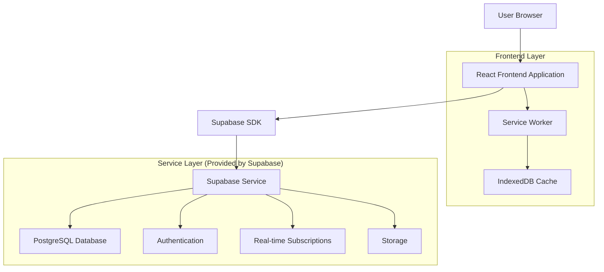
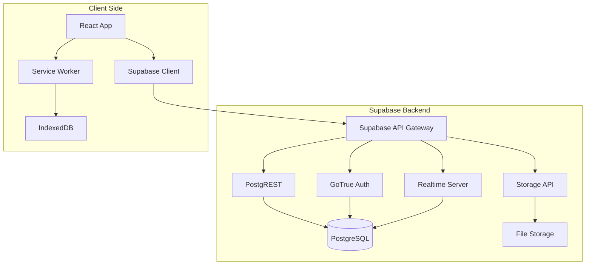
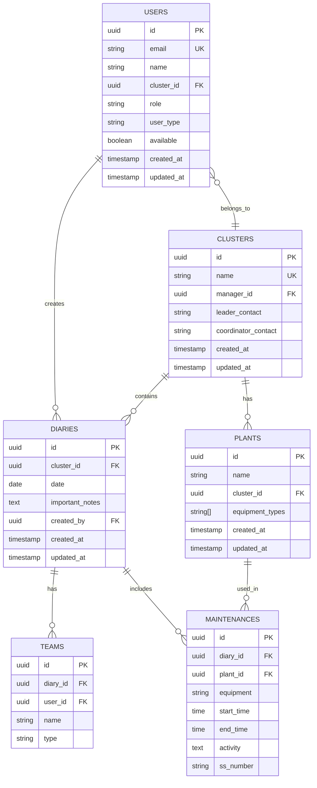

# Sistema de Diário de Atividades - Arquitetura Técnica

## 1. Architecture design



## 2. Technology Description

- Frontend: React@18 + TypeScript@5 + Vite@5 + TailwindCSS@3
- Backend: Supabase (PostgreSQL + Auth + Real-time + Storage)
- PWA: Workbox + Service Workers + IndexedDB
- UI Components: Lucide React + Headless UI
- Calendar: React Big Calendar
- Forms: React Hook Form + Zod validation
- State Management: Zustand
- Date Handling: date-fns
- Export Libraries: jsPDF + xlsx + file-saver
- External Integration: Sismetro API

## 3. Route definitions

| Route | Purpose |
|-------|----------|
| / | Página inicial - redirecionamento baseado em autenticação |
| /login | Página de login com seleção de cluster |
| /dashboard | Dashboard principal com resumo de atividades |
| /diary/new | Formulário para criar novo diário |
| /diary/:id/edit | Formulário para editar diário existente |
| /diary/:id | Visualização detalhada de um diário |
| /calendar | Calendário interativo com todas as atividades |
| /diaries | Lista paginada de todos os diários |
| /profile | Perfil do usuário e configurações |
| /admin | Painel administrativo (apenas admins) |
| /admin/users | Cadastro e gestão de usuários |
| /admin/clusters | Gestão de clusters |
| /admin/plants | Cadastro de usinas por cluster |
| /admin/reports | Relatórios consolidados |
| /teams | Gerenciamento de equipes do cluster |
| /teams/manage | Adicionar/remover membros da equipe |
| /offline | Página exibida quando offline |

## 4. API definitions

### 4.1 Core API

**Autenticação (Supabase Auth)**
```typescript
// Login
POST /auth/v1/token
Request: { email: string, password: string }
Response: { access_token: string, user: User }

// Logout
POST /auth/v1/logout
```

**Diários de Atividades**
```typescript
// Listar diários
GET /rest/v1/diaries
Query Params: cluster_id?, date_from?, date_to?, limit?, offset?
Response: Diary[]

// Criar diário
POST /rest/v1/diaries
Request: CreateDiaryRequest
Response: Diary

// Atualizar diário
PATCH /rest/v1/diaries?id=eq.{id}
Request: UpdateDiaryRequest
Response: Diary

// Deletar diário
DELETE /rest/v1/diaries?id=eq.{id}
```

**Clusters**
```typescript
// Listar clusters
GET /rest/v1/clusters
Response: Cluster[]

// Criar cluster (admin only)
POST /rest/v1/clusters
Request: CreateClusterRequest
Response: Cluster
```

**Usinas**
```typescript
// Listar usinas por cluster
GET /rest/v1/plants?cluster_id=eq.{cluster_id}
Response: Plant[]

// Criar usina (admin only)
POST /rest/v1/plants
Request: CreatePlantRequest
Response: Plant
```

**Usuários**
```typescript
// Listar usuários (admin only)
GET /rest/v1/users
Response: User[]

// Criar usuário (admin only)
POST /rest/v1/users
Request: CreateUserRequest
Response: User

// Atualizar disponibilidade
PATCH /rest/v1/users?id=eq.{id}
Request: { available: boolean }
Response: User

// Relatório de Solicitações de Serviço
GET /rest/v1/reports/ss
Query Params: cluster_id?, date_from?, date_to?
Response: SSReport[]

// Relatório de Horas Agendadas Diárias
GET /rest/v1/reports/hours
Query Params: cluster_id?, date_from?, date_to?
Response: HoursReport[]

// Exportação de relatórios
POST /rest/v1/reports/export
Request: { type: 'pdf' | 'excel', data: any }
Response: { download_url: string }

// Integração com sistema Sismetro
POST /rest/v1/external/sismetro
Request: SismetroIntegrationRequest
Response: SismetroResponse
```

### 4.2 TypeScript Types

```typescript
interface User {
  id: string;
  email: string;
  name: string;
  cluster_id: string;
  role: 'technician' | 'maintainer' | 'cluster_manager' | 'admin';
  user_type: 'technician' | 'maintainer';
  available: boolean;
  created_at: string;
  updated_at: string;
}

interface SSReport {
  cluster_name: string;
  plant_name: string;
  ss_count: number;
  activity_count: number;
  date_range: string;
}

interface HoursReport {
  date: string;
  total_hours: number;
  cluster_breakdown: {
    cluster_name: string;
    hours: number;
  }[];
}

interface ExportRequest {
  type: 'pdf' | 'txt' | 'excel';
  data: any;
  filename?: string;
}

interface SismetroIntegrationRequest {
  ss_number: string;
  action: 'open' | 'status';
}

interface SismetroResponse {
  success: boolean;
  url?: string;
  status?: string;
  message?: string;
}

interface Cluster {
  id: string;
  name: string;
  manager_id: string;
  leader_contact: string;
  coordinator_contact: string;
  created_at: string;
  updated_at: string;
}

interface Plant {
  id: string;
  name: string;
  cluster_id: string;
  equipment_types: string[];
  created_at: string;
  updated_at: string;
}

interface Diary {
  id: string;
  cluster_id: string;
  date: string;
  teams: Team[];
  maintenances: Maintenance[];
  important_notes: string;
  created_by: string;
  created_at: string;
  updated_at: string;
}

interface Team {
  id: string;
  name: string;
  type: 'technician' | 'maintainer';
  member_name: string;
}

interface Maintenance {
  id: string;
  plant: string;
  equipment: string;
  start_time: string;
  end_time: string;
  activity: string;
  ss_number: string;
}

interface CreateDiaryRequest {
  cluster_id: string;
  date: string;
  teams: Omit<Team, 'id'>[];
  maintenances: Omit<Maintenance, 'id'>[];
  important_notes: string;
}

interface UpdateDiaryRequest extends Partial<CreateDiaryRequest> {}

interface CreateClusterRequest {
  name: string;
  manager_id: string;
  leader_contact: string;
  coordinator_contact: string;
}

interface CreatePlantRequest {
  name: string;
  cluster_id: string;
  equipment_types: string[];
}

interface CreateUserRequest {
  email: string;
  name: string;
  cluster_id: string;
  role: 'technician' | 'maintainer' | 'cluster_manager';
  user_type: 'technician' | 'maintainer';
  password: string;
}
```

## 5. Server architecture diagram



## 6. Export and External Integration

### 6.1 Export Functionality
**Supported Formats:**
- **PDF**: Using jsPDF library for report generation
- **TXT**: Plain text format for simple data export
- **Excel**: Using xlsx library for spreadsheet generation

**Export Process:**
```typescript
// Export service implementation
class ExportService {
  async exportToPDF(data: any, filename: string): Promise<Blob>
  async exportToTXT(data: any, filename: string): Promise<Blob>
  async exportToExcel(data: any, filename: string): Promise<Blob>
}
```

### 6.2 Sismetro Integration
**External System Integration:**
- **Base URL**: https://br.sismetro.com/indexNEW.php
- **SS Link Format**: `?f=10&e={numerodass}`
- **Dynamic Link Generation**: Replace `{numerodass}` with actual SS number

**Integration Implementation:**
```typescript
class SismetroService {
  generateSSLink(ssNumber: string): string {
    return `https://br.sismetro.com/indexNEW.php?f=10&e=${ssNumber}`;
  }
  
  async openSS(ssNumber: string): Promise<void> {
    const url = this.generateSSLink(ssNumber);
    window.open(url, '_blank');
  }
}
```

## 7. Data model

### 6.1 Data model definition



### 6.2 Data Definition Language

**Users Table**
```sql
-- Create users table
CREATE TABLE users (
    id UUID PRIMARY KEY DEFAULT gen_random_uuid(),
    email VARCHAR(255) UNIQUE NOT NULL,
    name VARCHAR(100) NOT NULL,
    cluster_id UUID REFERENCES clusters(id),
    role VARCHAR(20) DEFAULT 'technician' CHECK (role IN ('technician', 'maintainer', 'cluster_manager', 'admin')),
    user_type VARCHAR(20) CHECK (user_type IN ('technician', 'maintainer')),
    available BOOLEAN DEFAULT true,
    created_at TIMESTAMP WITH TIME ZONE DEFAULT NOW(),
    updated_at TIMESTAMP WITH TIME ZONE DEFAULT NOW()
);

-- RLS Policies
ALTER TABLE users ENABLE ROW LEVEL SECURITY;
CREATE POLICY "Users can view own profile" ON users FOR SELECT USING (auth.uid() = id);
CREATE POLICY "Admins can view all users" ON users FOR SELECT USING (auth.jwt() ->> 'role' = 'admin');

-- Permissions
GRANT SELECT ON users TO authenticated;
GRANT ALL PRIVILEGES ON users TO service_role;
```

**Clusters Table**
```sql
-- Create clusters table
CREATE TABLE clusters (
    id UUID PRIMARY KEY DEFAULT gen_random_uuid(),
    name VARCHAR(100) UNIQUE NOT NULL,
    manager_id UUID REFERENCES users(id),
    leader_contact VARCHAR(100) NOT NULL DEFAULT 'Pedro Canosa',
    coordinator_contact VARCHAR(100) NOT NULL DEFAULT 'Edmilson Silva',
    created_at TIMESTAMP WITH TIME ZONE DEFAULT NOW(),
    updated_at TIMESTAMP WITH TIME ZONE DEFAULT NOW()
);

-- RLS Policies
ALTER TABLE clusters ENABLE ROW LEVEL SECURITY;
CREATE POLICY "Users can view own cluster" ON clusters FOR SELECT USING (
    id IN (SELECT cluster_id FROM users WHERE id = auth.uid())
);
CREATE POLICY "Admins can manage all clusters" ON clusters FOR ALL USING (auth.jwt() ->> 'role' = 'admin');

-- Permissions
GRANT SELECT ON clusters TO authenticated;
GRANT ALL PRIVILEGES ON clusters TO service_role;
```

**Plants Table**
```sql
-- Create plants table
CREATE TABLE plants (
    id UUID PRIMARY KEY DEFAULT gen_random_uuid(),
    name VARCHAR(100) NOT NULL,
    cluster_id UUID NOT NULL REFERENCES clusters(id),
    equipment_types TEXT[] DEFAULT '{}',
    created_at TIMESTAMP WITH TIME ZONE DEFAULT NOW(),
    updated_at TIMESTAMP WITH TIME ZONE DEFAULT NOW(),
    UNIQUE(name, cluster_id)
);

-- RLS Policies
ALTER TABLE plants ENABLE ROW LEVEL SECURITY;
CREATE POLICY "Users can view cluster plants" ON plants FOR SELECT USING (
    cluster_id IN (SELECT cluster_id FROM users WHERE id = auth.uid())
);
CREATE POLICY "Admins can manage all plants" ON plants FOR ALL USING (auth.jwt() ->> 'role' = 'admin');

-- Indexes
CREATE INDEX idx_plants_cluster_id ON plants(cluster_id);

-- Permissions
GRANT SELECT ON plants TO authenticated;
GRANT ALL PRIVILEGES ON plants TO service_role;
```

**Diaries Table**
```sql
-- Create diaries table
CREATE TABLE diaries (
    id UUID PRIMARY KEY DEFAULT gen_random_uuid(),
    cluster_id UUID NOT NULL REFERENCES clusters(id),
    date DATE NOT NULL,
    important_notes TEXT,
    created_by UUID NOT NULL REFERENCES users(id),
    created_at TIMESTAMP WITH TIME ZONE DEFAULT NOW(),
    updated_at TIMESTAMP WITH TIME ZONE DEFAULT NOW(),
    UNIQUE(cluster_id, date)
);

-- RLS Policies
ALTER TABLE diaries ENABLE ROW LEVEL SECURITY;
CREATE POLICY "Users can manage cluster diaries" ON diaries FOR ALL USING (
    cluster_id IN (SELECT cluster_id FROM users WHERE id = auth.uid())
);
CREATE POLICY "Admins can manage all diaries" ON diaries FOR ALL USING (auth.jwt() ->> 'role' = 'admin');

-- Indexes
CREATE INDEX idx_diaries_cluster_date ON diaries(cluster_id, date DESC);
CREATE INDEX idx_diaries_created_by ON diaries(created_by);

-- Permissions
GRANT ALL PRIVILEGES ON diaries TO authenticated;
```

**Teams Table**
```sql
-- Create teams table
CREATE TABLE teams (
    id UUID PRIMARY KEY DEFAULT gen_random_uuid(),
    diary_id UUID NOT NULL REFERENCES diaries(id) ON DELETE CASCADE,
    user_id UUID REFERENCES users(id),
    name VARCHAR(100) NOT NULL,
    type VARCHAR(20) NOT NULL CHECK (type IN ('technician', 'maintainer'))
);

-- RLS Policies
ALTER TABLE teams ENABLE ROW LEVEL SECURITY;
CREATE POLICY "Users can manage teams in cluster diaries" ON teams FOR ALL USING (
    diary_id IN (
        SELECT d.id FROM diaries d 
        JOIN users u ON u.cluster_id = d.cluster_id 
        WHERE u.id = auth.uid()
    )
);

-- Permissions
GRANT ALL PRIVILEGES ON teams TO authenticated;
```

**Maintenances Table**
```sql
-- Create maintenances table
CREATE TABLE maintenances (
    id UUID PRIMARY KEY DEFAULT gen_random_uuid(),
    diary_id UUID NOT NULL REFERENCES diaries(id) ON DELETE CASCADE,
    plant_id UUID REFERENCES plants(id),
    equipment VARCHAR(100) NOT NULL,
    start_time TIME NOT NULL,
    end_time TIME NOT NULL,
    activity TEXT NOT NULL,
    ss_number VARCHAR(50)
);

-- RLS Policies
ALTER TABLE maintenances ENABLE ROW LEVEL SECURITY;
CREATE POLICY "Users can manage maintenances in cluster diaries" ON maintenances FOR ALL USING (
    diary_id IN (
        SELECT d.id FROM diaries d 
        JOIN users u ON u.cluster_id = d.cluster_id 
        WHERE u.id = auth.uid()
    )
);

-- Indexes
CREATE INDEX idx_maintenances_diary_id ON maintenances(diary_id);
CREATE INDEX idx_maintenances_plant ON maintenances(plant);

-- Permissions
GRANT ALL PRIVILEGES ON maintenances TO authenticated;
```

**Initial Data**
```sql
-- Insert default clusters
INSERT INTO clusters (name, leader_contact, coordinator_contact) VALUES
('Cluster Porangatu', 'Pedro Canosa', 'Edmilson Silva'),
('Cluster Araraquara', 'Pedro Canosa', 'Edmilson Silva');

-- Create admin user (will be created via Supabase Auth)
-- INSERT INTO users (email, name, role) VALUES
-- ('admin@empresa.com', 'Administrador', 'admin');
```