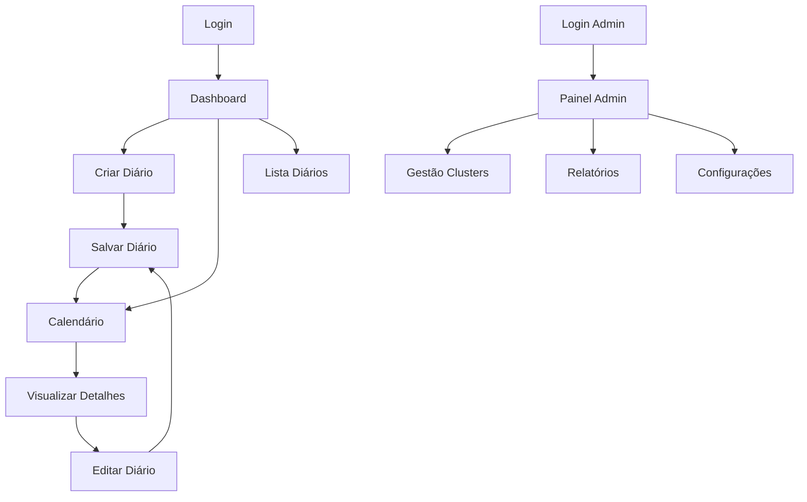

# Sistema de Diário de Atividades Diárias - PRD

## 1. Product Overview

Sistema web completo para gerenciamento de diários de atividades diárias de equipes de manutenção, baseado no modelo de "Informe Diário – Programação de Equipe". O sistema permite que diferentes clusters registrem suas atividades de manutenção programada de forma organizada e centralizada.

O produto resolve o problema de documentação manual e descentralizada das atividades de manutenção, oferecendo uma plataforma digital intuitiva para técnicos de campo e gestores. O sistema visa aumentar a eficiência operacional e melhorar o controle de atividades através de uma interface moderna e acessível.

## 2. Core Features

### 2.1 User Roles

| Role                   | Registration Method         | Core Permissions                                                           |
| ---------------------- | --------------------------- | -------------------------------------------------------------------------- |
| Técnico de Campo       | Cadastro pelo administrador | Criar e editar diários do próprio cluster, gerenciar equipes dinamicamente |
| Mantenedor             | Cadastro pelo administrador | Criar e editar diários do próprio cluster, gerenciar equipes dinamicamente |
| Responsável do Cluster | Cadastro pelo administrador | Todas as permissões do técnico/mantenedor + supervisionar cluster          |
| Administrador          | Acesso master do sistema    | Cadastrar usuários, clusters, usinas, gerenciar todos os dados do sistema  |

### 2.2 Feature Module

Nosso sistema de diário de atividades consiste nas seguintes páginas principais:

1. **Página de Login**: autenticação por cluster, seleção de perfil.
2. **Dashboard Principal**: visão geral das atividades, calendário mensal, atalhos rápidos.
3. **Criar/Editar Diário**: formulário baseado no modelo de informe diário, gerenciamento dinâmico de equipes.
4. **Calendário Interativo**: visualização mensal/semanal/diária, navegação entre datas, indicadores de status.
5. **Lista de Diários**: histórico de diários criados, filtros por data/cluster, busca.
6. **Gerenciar Equipes**: adicionar/remover membros da equipe, controle de disponibilidade.
7. **Painel Administrativo**: cadastro de usuários, clusters, usinas, relatórios consolidados.
8. **Relatórios Avançados**: relatórios de SS, horas agendadas, exportação em múltiplos formatos.
9. **Perfil do Usuário**: dados pessoais, configurações de notificação, troca de senha.

### 2.3 Page Details

| Page Name             | Module Name             | Feature description                                                                        |
| --------------------- | ----------------------- | ------------------------------------------------------------------------------------------ |
| Página de Login       | Autenticação            | Validar credenciais por cluster, recuperação de senha, lembrar login                       |
| Dashboard Principal   | Visão Geral             | Exibir resumo de atividades do dia, calendário compacto, notificações importantes          |
| Dashboard Principal   | Ações Rápidas           | Botões para criar novo diário, visualizar último diário, acessar calendário                |
| Criar/Editar Diário   | Informações Básicas     | Campos para cluster, data, seleção automática baseada no usuário logado                    |
| Criar/Editar Diário   | Equipes em Campo        | Selecionar membros disponíveis, definir tipo (técnico/mantenedor), gerenciar dinamicamente |
| Criar/Editar Diário   | Manutenções Programadas | Lista dinâmica com seleção de usinas cadastradas, equipamento, horário, atividade, SS      |
| Criar/Editar Diário   | Observações e Contatos  | Campo de texto livre para observações, contatos do líder e coordenador                     |
| Gerenciar Equipes     | Lista de Membros        | Visualizar todos os técnicos e mantenedores do cluster, status de disponibilidade          |
| Gerenciar Equipes     | Adicionar/Remover       | Adicionar novos membros à equipe, remover membros indisponíveis temporariamente            |
| Calendário Interativo | Navegação               | Alternar entre visualizações mensal/semanal/diária, navegar entre períodos                 |
| Calendário Interativo | Indicadores Visuais     | Mostrar dias com atividades, cores por status, preview ao hover                            |
| Lista de Diários      | Listagem                | Exibir diários em formato de cards/tabela, paginação, ordenação por data                   |
| Lista de Diários      | Filtros e Busca         | Filtrar por período, cluster, buscar por texto, exportar dados                             |
| Painel Administrativo | Cadastro de Usuários    | Criar técnicos, mantenedores e responsáveis, definir cluster de atuação                    |
| Painel Administrativo | Gestão de Clusters      | Criar/editar/desativar clusters, definir responsáveis, configurar permissões               |
| Painel Administrativo | Cadastro de Usinas      | Cadastrar usinas por cluster, definir equipamentos disponíveis                             |
| Painel Administrativo | Relatórios              | Gerar relatórios consolidados, estatísticas de atividades, exportação                      |
| Relatórios Avançados  | Relatório de SS         | Listar todas as SS adicionadas, quantidade por cluster e usina, filtros por período        |
| Relatórios Avançados  | Horas Agendadas         | Contagem total de horas agendadas por dia, análise temporal das atividades                 |
| Relatórios Avançados  | Exportação              | Exportar relatórios em PDF, TXT e Excel, download direto dos arquivos                      |
| Relatórios Avançados  | Abertura de SS          | Link direto para sistema externo, verificação de status das SS                             |
| Perfil do Usuário     | Configurações Pessoais  | Editar dados pessoais, alterar senha, preferências de notificação                          |

## 3. Core Process

**Fluxo do Técnico de Campo:**

1. Usuário faz login selecionando seu cluster
2. Acessa o dashboard e visualiza atividades do dia
3. Clica em "Criar Novo Diário" ou edita diário existente
4. Preenche informações das equipes em campo
5. Adiciona manutenções programadas com todos os detalhes
6. Inclui observações importantes e confirma contatos
7. Salva o diário e pode visualizar no calendário

**Fluxo do Administrador:**

1. Faz login com credenciais administrativas
2. Acessa painel administrativo centralizado
3. Visualiza resumo consolidado de todos os clusters
4. Gerencia clusters e usuários conforme necessário
5. Gera relatórios e exporta dados para análise

## 4. User Interface Design

### 4.1 Design Style

* **Cores Primárias**: Azul corporativo (#2563eb), Verde para status positivo (#16a34a)

* **Cores Secundárias**: Cinza neutro (#64748b), Laranja para alertas (#ea580c)

* **Estilo de Botões**: Arredondados (rounded-lg), com sombras sutis, estados hover/active

* **Tipografia**: Inter ou similar, tamanhos 14px (corpo), 16px (títulos), 12px (legendas)

* **Layout**: Design baseado em cards, navegação superior fixa, sidebar para admin

* **Ícones**: Lucide React ou Heroicons, estilo outline, tamanho consistente 20px

### 4.2 Routes Structure

| Route           | Description                                    |
| --------------- | ---------------------------------------------- |
| /login          | Página de autenticação                         |
| /dashboard      | Dashboard principal                            |
| /diary/create   | Criar novo diário                              |
| /diary/edit/:id | Editar diário existente                        |
| /calendar       | Calendário interativo                          |
| /diaries        | Lista de diários                               |
| /teams          | Gerenciar equipes                              |
| /profile        | Perfil do usuário                              |
| /admin          | Painel administrativo                          |
| /admin/users    | Gestão de usuários                             |
| /admin/clusters | Gestão de clusters                             |
| /admin/plants   | Cadastro de usinas                             |
| /admin/reports  | Relatórios consolidados                        |
| /reports/ss     | Relatório de Solicitações de Serviço           |
| /reports/hours  | Relatório de Horas Agendadas Diárias           |
| /reports/export | Exportação de relatórios em múltiplos formatos |

### 4.2 Page Design Overview

| Page Name             | Module Name            | UI Elements                                                                         |
| --------------------- | ---------------------- | ----------------------------------------------------------------------------------- |
| Página de Login       | Formulário Central     | Card centralizado, fundo gradiente azul, logo da empresa, campos com ícones         |
| Dashboard Principal   | Header                 | Barra superior com nome do cluster, avatar do usuário, notificações                 |
| Dashboard Principal   | Cards de Resumo        | Grid 2x2 com métricas principais, ícones coloridos, números destacados              |
| Dashboard Principal   | Calendário Compacto    | Widget de calendário no canto direito, dias com atividades destacados               |
| Criar/Editar Diário   | Formulário Estruturado | Layout em seções expansíveis, campos agrupados logicamente, validação em tempo real |
| Calendário Interativo | Visualização Principal | Calendário full-screen, cores por status, modal para detalhes rápidos               |
| Lista de Diários      | Cards de Atividades    | Lista de cards com preview das informações, ações rápidas (editar/visualizar)       |
| Painel Administrativo | Layout com Sidebar     | Navegação lateral fixa, conteúdo principal com tabelas e gráficos                   |

### 4.3 Responsiveness

O produto é mobile-first com adaptação completa para desktop. Interface otimizada para touch em tablets e smartphones, com navegação por gestos. Suporte completo a PWA com instalação nativa e funcionamento offline através de service workers e cache inteligente.

**Breakpoints:**

* Mobile: 320px - 768px (navegação em hambúrguer, cards empilhados)

* Tablet: 768px - 1024px (layout híbrido, sidebar colapsível)

* Desktop: 1024px+ (layout completo com sidebar fixa)

